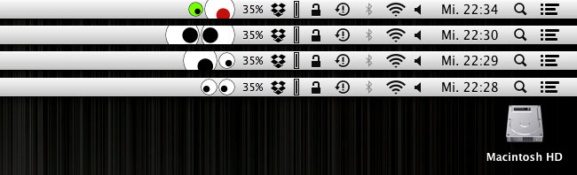

# Gucky

Gucky, nicht zu verwechseln mit dem [Mausbiber][], ist eine kleine App für OS X.
Sie setzt sich in die Statusleiste von OS X und verfolgt im guten alten [Xeyes][]
Style die Bewegung der Maus.
Eine kleine Anleitung und ein Download der fertig kompilierten App ist bei mir
im Blog unter [Gucky][] zu finden.

[Mausbiber]:http://www.perrypedia.proc.org/wiki/Gucky
[Xeyes]:http://de.wikipedia.org/wiki/Xeyes
[Gucky]:(http://blog.tigion.de/2013/03/20/gucky/

Das Projekt ist ursprünglich als kleine Übung für den Umgang mit Xcode und die
Sprache Objective-C entstanden.

*Das Testprojekt kann Spuren von Nüssen und fehlerhaften Code enthalten.*

## Screenshot

## Hinweise

- [bug] **Positionsabfrage** … bei Veränderungen der Position innerhalb der
  Statusleiste erfolgt noch keine automatische Aktualisierung, so dass in  dem
  Falle die Berechnung noch von der alten Position aus geht.
  Über den Menüpunkt: *Refresh Position* kann dies erstmal nur manuell behoben
  werden.

## Systemvoraussetzung

- mindestens OS X 10.7 und ein Intel Mac

## Lizenz

Folgt ...

## Historie

- **16.03.2013** gestartet